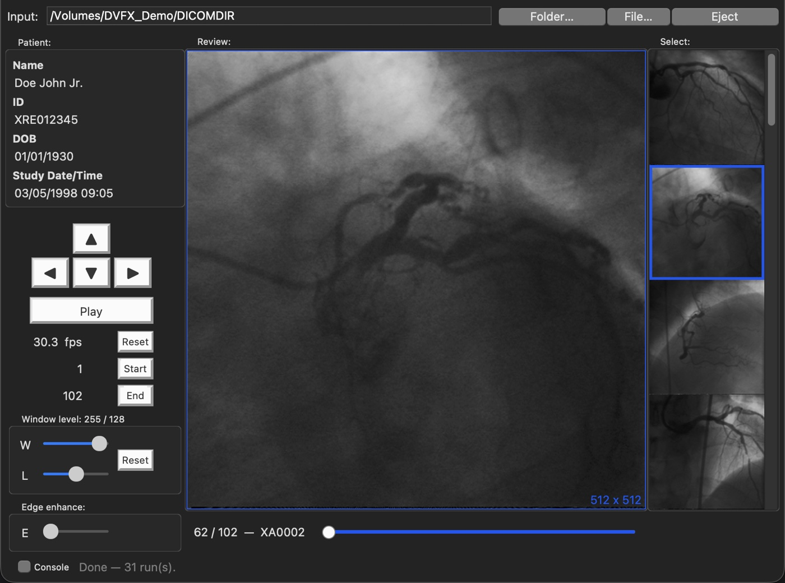

# MacAngioView

**A DICOM cine viewer for macOS** — play back cardiac catheterization
angiography (XA) runs and multiframe ultrasound (US) loops from study CDs,
disks, or exported folders.

🌐 **Website:** [macangioview.com](https://macangioview.com)
⬇️ **Download:** [MacAngioView.dmg (latest release)](https://github.com/wlapointe/MacAngioView/releases/latest/download/MacAngioView.dmg)

## Features

- **DICOM XA playback** — multi-frame cine-angiogram runs, including
  lossless-JPEG compressed studies from cardiac catheter X-ray systems
- **Multiframe ultrasound (US)** — echo and vascular ultrasound cine loops
  play back the same way as angiography runs
- **Broad compatibility** — reads studies exported from many cath-lab and
  ultrasound imaging systems; just open a study CD or folder
- **Frame-by-frame review** — step through frames and adjust playback speed
- **Export** — save cine runs as standard movie files for presentations and
  teaching
- **Reports** — view encapsulated PDF reports included in a study

## Requirements

- macOS 12 (Monterey) or later — Apple silicon or Intel
- DICOM XA or multiframe US studies on CD, disk, or folder

## Install

1. Download [`MacAngioView.dmg`](https://github.com/wlapointe/MacAngioView/releases/latest/download/MacAngioView.dmg)
2. Double-click the `.dmg` and drag **MacAngioView** onto **Applications**
3. Launch from your Applications folder

The app is signed and notarized by Apple, so it opens with no security
warnings.

## Support

Questions or feedback? Email [wil.lapointe@mac.com](mailto:wil.lapointe@mac.com).

---

> **Not for clinical use.** MacAngioView is intended for review and
> educational purposes. It is not certified as a medical device and must not
> be used for primary diagnosis or treatment decisions.
