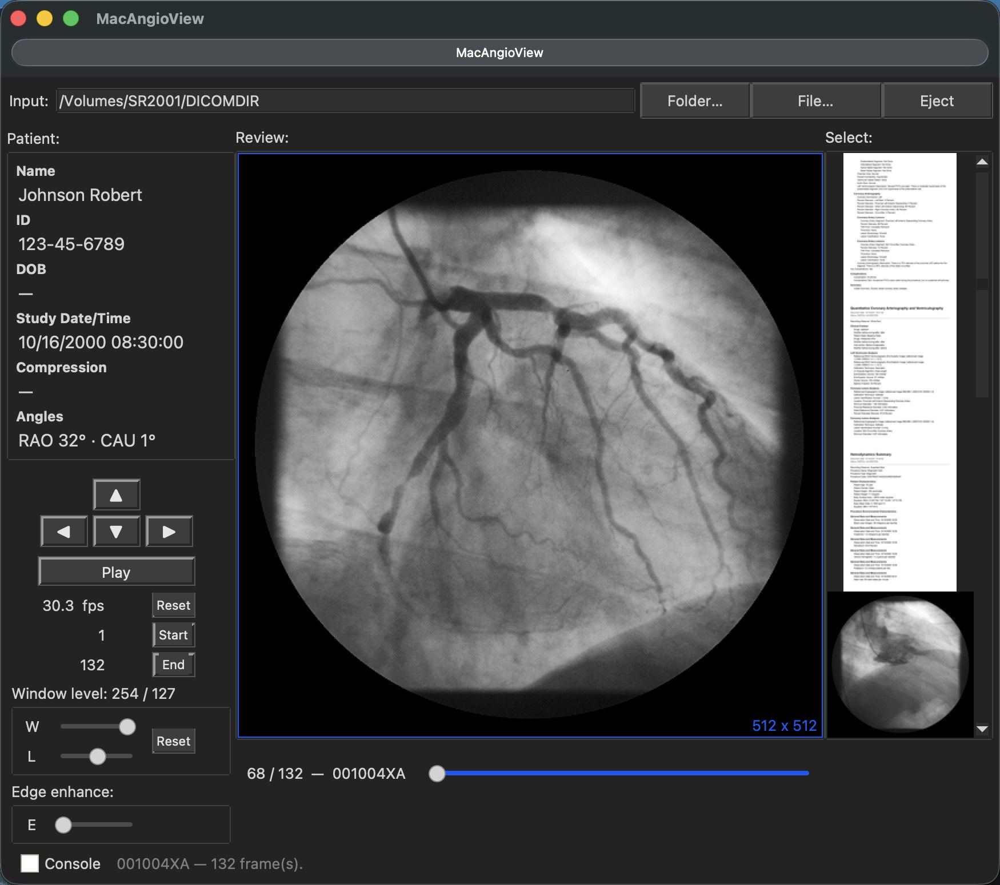

# MacAngioView

**A DICOM cine viewer** — play back cardiac catheterization
angiography (XA) runs and multiframe ultrasound (US) loops from study CDs,
disks, or exported folders.

🌐 **Website:** [macangioview.com](https://macangioview.com)
⬇️ **Download:** [MacAngioView.dmg (Mac)](https://github.com/wlapointe/MacAngioView/releases/latest/download/MacAngioView.dmg) · [MacAngioView-Windows.zip (Windows)](https://github.com/wlapointe/MacAngioView/releases/latest/download/MacAngioView-Windows.zip)

## Features

- **DICOM XA / RF playback** — multi-frame cine-angiogram and
  radiofluoroscopic runs, including lossless-JPEG compressed studies from
  cardiac catheter X-ray systems
- **Multiframe ultrasound (US)** — echo and vascular ultrasound cine loops
  play back the same way as angiography runs
- **CT/CTA series** — a study's CT slices are grouped into one browsable
  stack and stepped frame by frame, with a Preset picker for multi-valued
  window/level (soft tissue, bone, lung)
- **Broad compatibility** — reads studies exported from many cath-lab,
  ultrasound, and CT imaging systems; just open a study CD or folder
- **Frame-by-frame review** — step through frames and adjust playback speed
- **DSA subtraction** — view angiograms with the standing anatomy subtracted
  away, automatically or from a manually picked mask frame
- **Export** — save cine runs as standard movie files for presentations and
  teaching
- **Reports & waveforms** — view a study's encapsulated PDF reports, DICOM
  Structured Reports (cath, QCA, hemodynamics, ECG summaries), and Waveform
  Storage instances (12-lead ECG, hemodynamic, cardiac EP) rendered as
  calibrated lead-strip pages, alongside the imaging
- **Quiz Mode** — a self-study workflow that hides a study's own report until
  you're ready, then lets you record your own findings and check them
  against it
- **Caliper Tool** — two-click mm distance measurement, calibrated
  automatically from ultrasound region or XA beam geometry, or manually from
  a catheter shaft

## Requirements

- Mac — macOS 12 (Monterey) or later, Apple silicon or Intel
- Windows — Windows 10 or 11, 64-bit
- DICOM XA or multiframe US studies on CD, disk, or folder

## Install (Mac)

1. Download [`MacAngioView.dmg`](https://github.com/wlapointe/MacAngioView/releases/latest/download/MacAngioView.dmg)
2. Double-click the `.dmg` and drag **MacAngioView** onto **Applications**
3. Launch from your Applications folder

The Mac build is signed and notarized by Apple, so it opens with no security
warnings.

## Install (Windows)

1. Download [`MacAngioView-Windows.zip`](https://github.com/wlapointe/MacAngioView/releases/latest/download/MacAngioView-Windows.zip)
2. Right-click the zip, choose **Extract All…**, then open the extracted
   **MacAngioView** folder — don't run the `.exe` from inside Explorer's
   zip preview, which can drop the files the app needs alongside it
3. Double-click **MacAngioView.exe**

The Windows build isn't code-signed yet, so SmartScreen will show
"Windows protected your PC" on first launch — click **More info**, then
**Run anyway**.

## Support

Questions or feedback? Email [wil.lapointe@mac.com](mailto:wil.lapointe@mac.com).

---

> **Not for clinical use.** MacAngioView is intended for review and
> educational purposes. It is not certified as a medical device and must not
> be used for primary diagnosis or treatment decisions.
